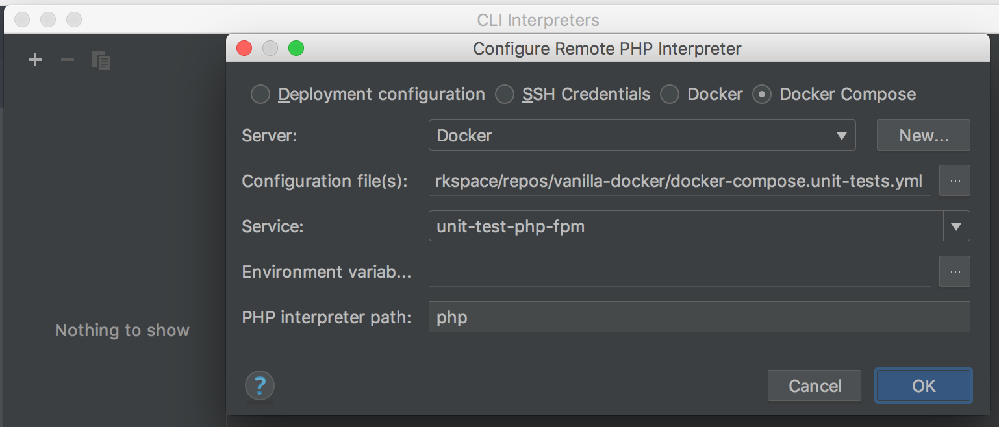
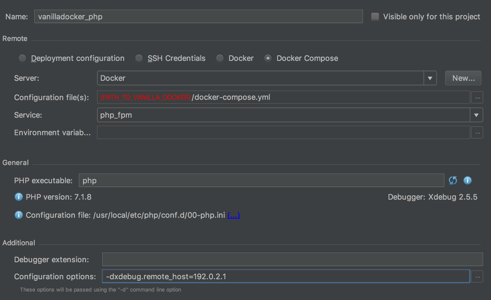
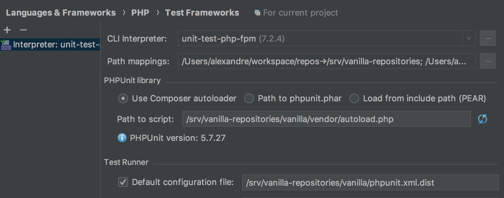

## Make unit tests work within PhpStorm

### Configure Docker

`PhpStorm` > `Preferences` > `Build, Execution, Deployment` > `Docker`

Add a new docker instance and choose "Docker for Mac".
*Note that from here on the beginning of paths shown in the images might differ from yours.*

`PhpStorm` > `Preferences` > `Languages & Frameworks` > `PHP`

Click on `...` which is located beside "CLI Interpreter".

Add a new instance by pressing the + button:


with the following configuration:



You should have the a similar result:



### Add Test Framework configuration

This example works to run the unit tests of Vanilla.

`PhpStorm` > `Preferences` > `Languages & Frameworks` > `PHP` > `Test Frameworks`

- Add a new instance and choose: `PHPUnit by Remote Interpreter`
- Select `unit-tests-php-fpm`



### Export environment variable

Export `TEST_DB_HOST=database` so that unit tests know the host for the database inside the php-fpm container.

If you are using bash (that's the default on Mac OSX) you can do:
```bash
echo "export TEST_DB_HOST=database" >> ~/.bash_profile
```

### Running the tests

- Open [https://github.com/vanilla/vanilla](vanilla/vanilla) with PhpStorm
- `Run` > `Edit Configurations...`
- Add a new `PHPUnit` by clicking on the `+` button.
- Name it "Vanilla tests" and, under `Test Runner`, choose `Defined in the configuration file`
