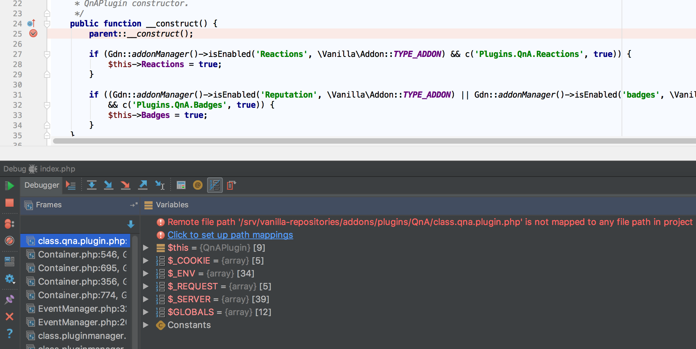
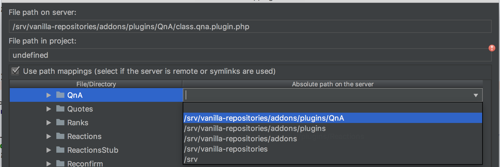

## Make Xdebug work with PhpStorm

`Tools` > `DBGp Proxy` > `Configuration`

- `IDE Key`: PHPSTORM
- `Host`: 127.0.0.1
- `Port`: 9000

Install an [Xdebug helper](https://confluence.jetbrains.com/display/PhpStorm/Browser+Debugging+Extensions)
on your browser and set the key to PHPSTORM.

You can now click on `Run` > `Start listening for PHP Debug connection` in PhpStorm and enable the browser extension.
Put a debug break point.

Have fun!

### Symlinks mapping

After putting a breakpoint in a file that was symlinked you will probably encounter this: 

To fix that issue you need to click on "Click to set up path mappings" in order to map the symlink path to the real path like so:

